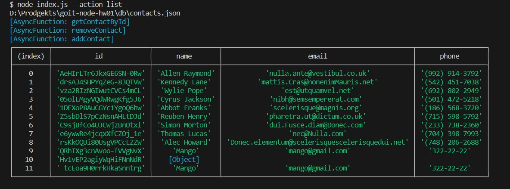

# Cкріншоти результату виконання кожної команди

### 1) Отримуємо і виводимо весь список контактів у вигляді таблиці (console.table)

node index.js --action="list"

https://monosnap.com/file/KiAbLx94tjbhTcCsoqqfTpbT9FdzPA

### 2) Отримуємо контакт по id і виводимо у консоль об'єкт контакту або null, якщо контакту з таким id не існує.

node index.js --action="get" --id 05olLMgyVQdWRwgKfg5J6

https://monosnap.com/file/9tmDymL5BwZ6UHMd924JlpdjYcyAw8

![Screenshoot] (./assets/screenshot_2.jpg)

### 3) Додаємо контакт та виводимо в консоль об'єкт новоствореного контакту

node index.js --action="add" --name Mango --email mango@gmail.com --phone 322-22-22

https://monosnap.com/file/SzfTicZTUKE2Nx9YzxiUsDEbFwiP2Q

![Screenshoot] (./assets/screenshot_3.jpg)

### 4) Видаляємо контакт та виводимо в консоль об'єкт видаленого контакту або null, якщо контакту з таким id не існує.

node index.js --action="remove" --id qdggE76Jtbfd9eWJHrssH

https://monosnap.com/file/x8vws4O1LxMqtgazyDVLdXedc7cDcO

![Screenshoot] (./assets/screenshot_4.jpg)
